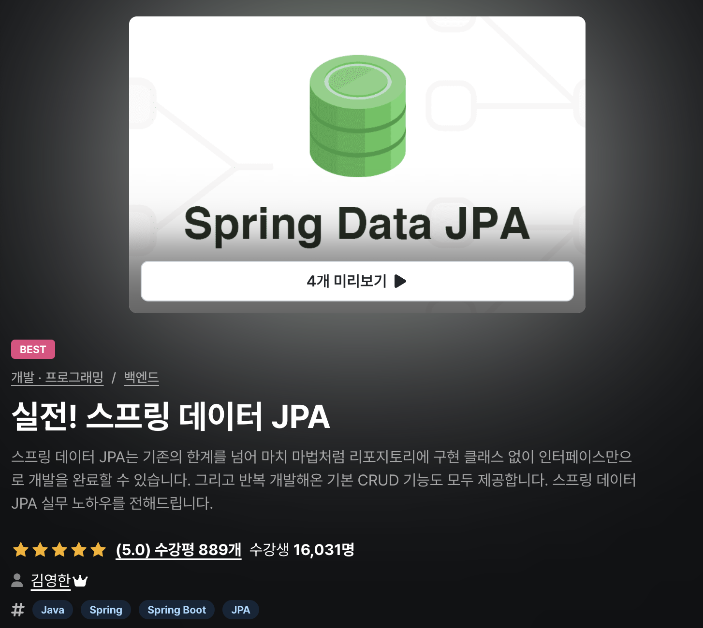

# Simple Spring Data Jpa

    

[실전! 스프링 데이터 JPA, 김영환](https://www.inflearn.com/course/%EC%8A%A4%ED%94%84%EB%A7%81-%EB%8D%B0%EC%9D%B4%ED%84%B0-JPA-%EC%8B%A4%EC%A0%84) 강의를 듣고 Spring-data-jpa 사용법을 까먹지 않기 위해 기록한 Repo

---

# Script 01

## [1. 파라미터 바인딩 & 반환 타입](./scripts/script-01/README.md#1-파라미터-바인딩--반환-타입)

## [2. 페이징 & 정렬](./scripts/script-01/README.md#2-정렬과-페이징)

## [3. 벌크성 수정 쿼리](./scripts/script-01/README.md#3-벌크성-수정-쿼리)

---

# Script 02

## [1. `@EntityGraph`](./scripts/script-02/README.md#1-entitygraph)

## [2. Lock & Query Hints](./scripts/script-02/README.md#2-lock--query-hints)

## [3. Auditing](./scripts/script-02/README.md#3-auditing)

---
