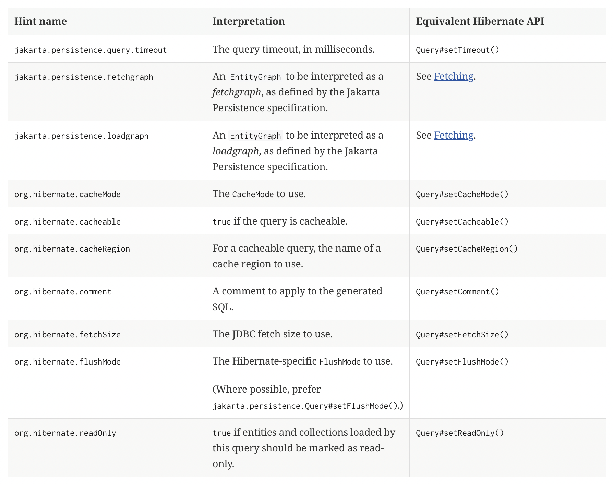

# 1. `@EntityGraph`

JPA 에서 JPQL 의 `join fetch` 를 통해 연관된 엔티티를 같이 영속시킬 수 있으며, 이는 Spring data jpa 또한 마찬가지이다.

```java
@Query("select m from Member m left join fetch m.team")
List<Member> findAllFetchingTeam();
```

하지만 만약 연관된 엔티티가 많거나 비즈니스 로직상 fetch join 이 많이 필요할 경우, 위처럼 메서드에 `@Query("... join fetch ...")` 하는 것이 귀찮을 수 있다.

이를 해결해주는 기능이 `@EntityGraph` 이다.

```java
@Query("select m from Member m")
@EntityGraph(attributePaths = {"team"})     // 연관 엔티티 필드 명
List<Member> findAllWithEntityGraph();
```

위처럼 `attributePaths` 속성에 필드명을 제시해 사용할 수도 있고, 엔티티에 `@NamedEntityGraph` 를 정의해 이용할 수도 있다.

```java
@Entity
@NamedEntityGraph(
        name = "fetchTeamOnMember",
        attributeNodes = {@NamedAttributeNode(
                value = "team"      // 연관 엔티티 필드 명
        )})
class Member {

    /* ... id 생략 ... */

    private String name;

    @ManyToOne(fetch = FetchType.LAZY)
    private Team team;
}

interface MemberRepository extends JpaRepository<Member, Long> {

    /* ... */

    @Query("select m from Member m")
    @EntityGraph(attributePaths = {"team"})
    List<Member> findAllWithEntityGraph();

    @Query("select m from Member m")
    @EntityGraph(value = "fetchTeamOnMember")
    List<Member> findAllWithNamedEntityGraph();
}
```

결국 `@EntityGraph` 는 여러 연관 엔티티를 fetch join 할 편의기능일 뿐이다.

관련 공식 문서 : [Spring Data JPA - Configuring Fetch- and LoadGraphs
](https://docs.spring.io/spring-data/jpa/reference/jpa/query-methods.html#jpa.entity-graph)

---

# 2. Lock & Query Hints

해당 부분은 들어가면 매우 깊은 내용이므로 찍먹 정도로만 소개한다.

---

## I. `@Lock`

관련 공식 문서 : [Hibernate ORM User Guide - 11. Locking](https://docs.jboss.org/hibernate/orm/6.5/userguide/html_single/Hibernate_User_Guide.html#locking)

RDB 에서 _LOCK_ 은 매우 중요한 요소로 트랜잭션 사이의 동일성을 보장하기 위해 사용된다.

Spring data jpa 도 이를 지원하는 어노테이션이 있는데, 바로 `@Lock` 이다.

```java
@Lock(LockModeType.OPTIMISTIC)
@Query("select e from TestEntity e")
List<TestEntity> findAllWithLock();
```

`@Lock` 을 통해 쿼리를 실행 시 설정할 `LockModeType` 을 명시할 수 있으며, 다음과 같은 `LockModeType` 이 존재한다. (`LockModeType` 은 JPA 에 속해있다. 표준이라는 소리)

|        `LockModeType`         |                                                       Comment                                                       |
|:-----------------------------:|:-------------------------------------------------------------------------------------------------------------------:|
|            `READ`             |                 Synonymous with `OPTIMISTIC`. `OPTIMISTIC` is to be preferred for new applications.                 |
|            `WRITE`            | Synonymous with `OPTIMISTIC_FORCE_INCREMENT`. `OPTIMISTIC_FORCE_IMCREMENT` is to be preferred for new applications. |
|         `OPTIMISTIC`          |                                                  Optimistic lock.                                                   |
| `OPTIMISTIC_FORCE_INCREMENT`  |                                        Optimistic lock, with version update.                                        |
|      `PESSIMISTIC_READ`       |                                               Pessimistic read lock.                                                |
|      `PESSIMISTIC_WRITE`      |                                               Pessimistic write lock.                                               |
| `PESSIMISTIC_FORCE_INCREMENT` |                                    Pessimistic write lock, with version update.                                     |
|            `NONE`             |                                                      No lock.                                                       |

_LOCK_ 은 DB 와 연관이 깊은 내용이니 별도로 검색해 공부하도록 하자. ~~(사실 나도 모름)~~

---

## II. `@QueryHints`


Spring data jpa 는 결국 표준 스펙 JPA 를 Spring 으로 감싸는 기술이다. 때문에 가끔 어느 작업을 더 최적화 할 수 있으메도 불구하고 그러지 못한 경우가 존재한다.

이를 해결하기 위해 우리는 JPA 구현체에게 _"~~~ 하게 행동해"_ 라 이야기 해줄 수 있는데, 이것이 바로 `@QueryHint` 어노테이션이다.

```java
@QueryHints(value = {
        @QueryHint(name = "jakarta.persistence.query.timeout", value = "2000")
})
@Query("select e from TestEntity e")
List<TestEntity> findAllWithTimeout();
```

Hibernate 공식문서를 보면 대표적으로 어떤 query hint 가 존재하는지 보여주고 있다. [`[1]`](#reference)

<p align="center">
    
</p>

`@QueryHint` 는 결국 JPA 구현체에게 힌트를 전달하므로, JPA 구현체가 달라지면 사용할 수 있는 힌트가 변할 수 있다.


---

## III. 그래서 왜 중요함?

`@Lock` 이야 그렇다 쳐도 `@QueryHints` 가 왜 필요한지 의문이 들 수 있다.

이를 조금이라도 해소하고자 적용 예시를 모아봤으니 참고하자.

- [Spring Data Jpa에서 데이터베이스별 lock timeout 설정 테스트 - rudaks's Tistory](https://rudaks.tistory.com/entry/Spring-Data-Jpa%EC%97%90%EC%84%9C-%EB%8D%B0%EC%9D%B4%ED%84%B0%EB%B2%A0%EC%9D%B4%EC%8A%A4%EB%B3%84-lock-timeout-%EC%84%A4%EC%A0%95-%ED%85%8C%EC%8A%A4%ED%8A%B8)
- [Spring Boot, JPA, Hibernate L2 Cache 활성화하기 - 지단로보트's Tistory](https://jsonobject.tistory.com/22)

더불어 `@Transactional(readOnly = true)` 와 `@QueryHint(name = "org.hibernate.readOnly", value = "true")` 의 차이점을 확인하려 했으나 아직 명확하게 파악하지 못했다.

추후 알게 된다면 정리해 보도록 하겠다.

---

# 3. Auditing

엔티티를 설계할 때 종종 운영 편의를 위해 `생성 & 수정일`, `등록 & 수정자` 를 포함시킨다. JPA 에서도 `@PrePersist`, `@PreUpdate` 등을 통해 조절할 수 있지만 이는 조금 불편할 수 있다.

때문에 Spring data jpa 는 _Auditing_ 기능을 제공해 그 번거로운 작업을 완화시킨다. 

관련 공식 문서 : [Spring Data JPA - Auditing](https://docs.spring.io/spring-data/jpa/reference/auditing.html)

```java
@EnableJpaAuditing
@SpringBootApplication
class Application {

    public static void main(String[] args) {
        SpringApplication.run(Application.class, args);
    }

}

@MappedSuperclass
@EntityListeners(AuditingEntityListener.class)
abstract class BaseTimeEntity {

  @CreatedDate
  @Column(updatable = false)
  @ColumnDefault("CURRENT_TIME()")
  private LocalDateTime createdAt;

  @LastModifiedDate
  @ColumnDefault("CURRENT_TIME()")
  private LocalDateTime lastModifiedAt;
}
```

_Auditing_ 의 영문 해석은 _"감시하다"_ 로, 뜻 그대로 엔티티를 감시해 자신이 알아서 값을 넣어줄 수 있다.

_Auditing_ 을 사용하기 위해선 `@EnableJpaAuditing` 이 붙은 _Configuration_ 과, 사용하려는 `엔티티 or @MappedSuperclass` 에 `@EntityListeners( ... )` 가 필요하다.

Spring data jpa 가 제공하는 _Auditing_ 은 `@CreatedDate`, `@LastModifiedDate`, `@CreatedBy`, `@LastModifiedBy` 가 존재한다.

`@~~~Date` 의 경우 어차피 해당 시간 정보를 넣어주면 되므로 별다른 설정이 필요하지 않다.
하지만 `@~~~By` 의 경우 그 "누구" 에 해당하는 정보를 어떻게 제공할지 설정해야 한다.

```java
@MappedSuperclass
@EntityListeners(AuditingEntityListener.class)
abstract class BaseTimeAndConfigurerEntity
        extends BaseTimeEntity {

    @CreatedBy
    private String createdBy;

    @LastModifiedBy
    private String lastModifiedBy;
}

@Configuration
@EnableJpaAuditing
class AuditingConfig {

  @Bean
  public AuditorAware<String> auditorProvider() {
    return () -> Optional.of(UUID.randomUUID().toString());
  }
}
```

이를 위한 것이 `AuditorAware<T>` 로, `AuditorAware` 에 해당하는 Bean 을 정의해 정보를 어떻게 제공할 것인지 구성할 수 있다.

```java
package org.springframework.data.domain;

/**
 * Interface for components that are aware of the application's current auditor. This will be some kind of user mostly.
 *
 * @param <T> the type of the auditing instance.
 * @author Oliver Gierke
 */
public interface AuditorAware<T> {

	/**
	 * Returns the current auditor of the application.
	 *
	 * @return the current auditor.
	 */
	Optional<T> getCurrentAuditor();
}
```

여담으로 Spring Data JPA 공식문서를 가보면 Spring Security 를 활용한 예시가 존재해 참고하기 좋다.

```java
class SpringSecurityAuditorAware implements AuditorAware<User> {

  @Override
  public Optional<User> getCurrentAuditor() {

    return Optional.ofNullable(SecurityContextHolder.getContext())
            .map(SecurityContext::getAuthentication)
            .filter(Authentication::isAuthenticated)
            .map(Authentication::getPrincipal)
            .map(User.class::cast);
  }
}
```

---

## Reference

- [Hibernate ORM User Guide](https://docs.jboss.org/hibernate/orm/6.5/userguide/html_single/Hibernate_User_Guide.html)
    - `[1]` : [16.3.4. Using query hints to control query execution](https://docs.jboss.org/hibernate/orm/6.5/userguide/html_single/Hibernate_User_Guide.html#jpql-query-hints)

---
